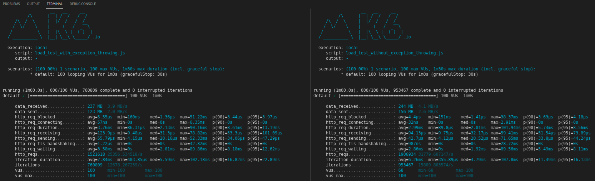

## What does the [documentation](https://docs.microsoft.com/en-us/aspnet/core/performance/performance-best-practices?view=aspnetcore-3.1#minimize-exceptions) says 🤔?

"**Exceptions should be rare.** Throwing and catching exceptions is slow relative to other code flow patterns. Because of this, exceptions shouldn't be used to control normal program flow."

Well, according to the ASP.NET documentation, you **should not** throw exceptions like this:
```csharp 
throw new Exception("Throwing some random exception here");
```

Especially within the [hot code paths](https://docs.microsoft.com/en-us/aspnet/core/performance/performance-best-practices?view=aspnetcore-3.1#understand-hot-code-paths), which are basically, pieces of code that run too often, such as **validations**.

## Commom scenario
To illustrate, let's imagine you need to create a WebApi that for each incoming request it needs to validate if the request meets the api rules or not.

**Exemple**: When receiving a user registration request, the API should validate the user's email. If the email is invalid, the application **should not** proceed with this registration.

`This is the point where many developers usually follow the exception throwing code practice.`

So now, you might be wondering: *"Okay, but what is the problem by throwing exceptions if I'm catching those exceptions later?"*

Next, we'll go into detail on how you can avoid this bad practice, but first, I'd like to make a few observations:
 - You **can** work with exceptions and even create your own exceptions, as long as they make sense for your application.
 - The problem addressed in this post is the **performance loss** caused by **throwing exceptions**.

To exemplify what the "wrong" (less performant) way of handling validations would look like, let's use the previous scenario:

## With throwing exceptions

```csharp
private static string INVALID_EMAIL = "invalid_email#123";

public IActionResult ThrowingException()
{
    try
    {
        var request = new CreateUserRequest(email: INVALID_EMAIL);
        validator.ValidateAndThrow(request);
        return Ok();
    }
    catch (Exception ex)
    {
        return BadRequest(ex.Message);
    }
}
```

## Without throwing exceptions

```csharp 
private static string INVALID_EMAIL = "invalid_email#123";

public IActionResult NotThrowingException()
{
    var request = new CreateUserRequest(email: INVALID_EMAIL);
    var validationResult = validator.Validate(request);

    return Ok(validationResult);
}
```

## Let's see the results

### BenchmarkDotNet


### K6 - Load Testing

Below we see the result of a simple load test in our api, using [k6.io](k6.io) lasting 1 minute and 100 [Virtual Users](https://k6.io/docs/using-k6/options/#vus) (VUs).

On the **left side** the endpoint that throws an exception, and on the **right side** the results of the endpoint that handles validation without throwing exceptions.



## Results

After analyzing the results, it's not hard to see that throwing exceptions causes considerable degradation in the performance of your application, so use them with care. 😋

## Referências 

https://docs.microsoft.com/en-us/aspnet/core/performance/performance-best-practices?view=aspnetcore-3.1#minimize-exceptions

https://www.thecodebuzz.com/best-practices-for-handling-exception-in-net-core-2-1/

https://stackify.com/finding-hidden-exceptions-application-performance-problems-apm/
