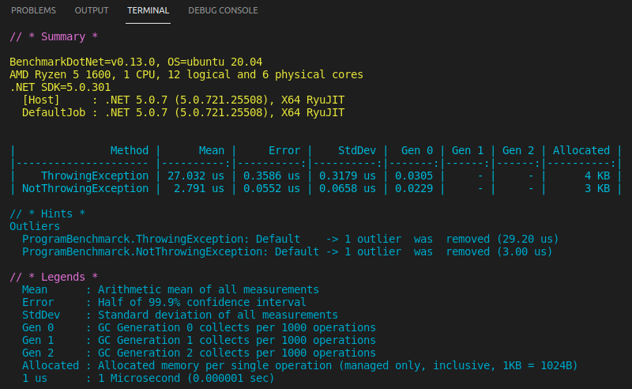
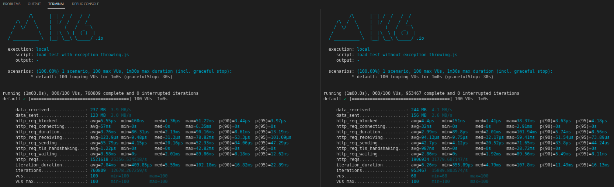

## O que diz a [documentação](https://docs.microsoft.com/en-us/aspnet/core/performance/performance-best-practices?view=aspnetcore-3.1#minimize-exceptions) 🤔?

"**Exceptions should be rare.** Throwing and catching exceptions is slow relative to other code flow patterns. Because of this, exceptions shouldn't be used to control normal program flow."

Bom, de acordo com a documentação do framework, você deve evitar, ao máximo, fazer o lançamento de exceções como:
```csharp 
throw new Exception("Throwing some random exception here");
```
Principalmente dentro dos [hot code paths](https://docs.microsoft.com/en-us/aspnet/core/performance/performance-best-practices?view=aspnetcore-3.1#understand-hot-code-paths), que são, basicamente, trechos (fluxos) da sua aplicação que são executados com muita frequência, como por exemplo: **validações**.

## Um cenário comum
Para exemplificar, vamos imaginar que você precise construir uma web api, que deve verificar cada requisição recebida e validar se a mesma atende ou não às regras de negócio.

**Exemplo**: Ao receber uma requisição para cadastrar um novo usuário, a aplicação deve verificar se o email enviado é válido. Caso o email seja inválido, esta requisição deverá ser invalidada e aplicação **não** deve seguir com o seu processamento.

`Este é o ponto onde muitos desenvolvedores fazem uso do lançamento de exceções.`

Então você deve está se perguntando: *"Certo, mas qual o problema de lançar exceções já que estou capturando essas exceções mais a frente?"*

A seguir, vamos entrar em detalhes de como você pode evitar essa má prática, mas primeiramente, gostaria de fazer algumas observações: 
 - Você **pode** trabalhar com exceções e até mesmo criar as suas próprias exceptions, desde que façam sentido para a sua aplicação.
 - O problema abordado neste post é a **perda de performance** causada pelo **lançamento de exceções**.

Para exemplificar como seria a maneira "errada" (menos performática) de tratar validações, vamos usar o cenário citado anteriormente:

## Com lançamento de exceções

```csharp
private static string INVALID_EMAIL = "invalid_email#123";

public IActionResult ThrowingException()
{
    try
    {
        var request = new CreateUserRequest(email: INVALID_EMAIL);
        validator.ValidateAndThrow(request);
        return Ok();
    }
    catch (Exception ex)
    {
        return BadRequest(ex.Message);
    }
}
```

## Sem lançamento de exceções

```csharp 
private static string INVALID_EMAIL = "invalid_email#123";

public IActionResult NotThrowingException()
{
    var request = new CreateUserRequest(email: INVALID_EMAIL);
    var validationResult = validator.Validate(request);

    return Ok(validationResult);
}
```

## Vejamos os resultados

### BenchmarkDotNet


### K6 - Load Testing

A seguir vemos o resultado de um simples teste de carga em nossa api, utilizando o [k6.io](k6.io) com duração de 1 minuto e 100 [Virtual Users](https://k6.io/docs/using-k6/options/#vus) (VUs).

À **esquerda** o endpoint que faz o lançamento de uma exceção, e à **direita** os resultados do endpoint trata a validação sem lançar exceções.



## Conclusão

Após analisar os resultados, não é difícil perceber que o lançamento de exceções gera uma degradação considerável na performance da sua aplicação, então use-as com cuidado. 😋

## Referências 

https://docs.microsoft.com/en-us/aspnet/core/performance/performance-best-practices?view=aspnetcore-3.1#minimize-exceptions

https://www.thecodebuzz.com/best-practices-for-handling-exception-in-net-core-2-1/

https://stackify.com/finding-hidden-exceptions-application-performance-problems-apm/
